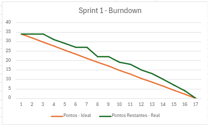

<h1 align="center"> floatData - Sprint 1 </h1>
<h2 align="center"> FATEC Professor Francisco de Moura, Jacareí - 4º Semestre DSM 2025 </h2>

<h1 align="center">Sprints</h1>

<h2>Sprint 1</h2>

**Período:** 24/03/2025 a 15/04/2025

**Objetivo:** Desenvolver o protótipo inicial do dispositivo IoT e estruturar a base do projeto

### User Stories e Tarefas

| User Story | Tarefa | Prioridade | Pontos |
|------------|--------|------------|--------|
| US 01 | Criar página de login com campos de e-mail e senha | Alta | 3 |
| US 01 | Implementar autenticação com JWT no backend | Alta | 3 |
| US 01 | Validar credenciais e armazenar token no frontend | Alta | 2 |
| US 01 | Proteger rotas do frontend com token | Alta | 2 |
| US 01 | Exibir mensagens de erro para login inválido | Alta | 1 |
| US 01 | Persistência dos dados do Login no Banco de dados | Alta | 3 |
| US 02 | Criar endpoint para receber localização do derivador | Alta | 5 |
| US 02 | Salvar localização no banco de dados com timestamp | Alta | 2 |
| US 03 | Montagem do circuito para transmissão de dado para o Servidor | Alta | 5 |
| US 07 | Criação da tela de Dashboard | Alta | 3 |
| US 08 | Ajustar o mapa para o mobile | Alta | 2 |
| US 08 | Testar o app para desktop | Alta | 1 |
| US 09 | Criar página com sobre (descrição) do projeto | Alta | 2 |

### Descrição das User Stories
- **US 01**: Como usuário, quero poder fazer login no sistema para acessar as funcionalidades do aplicativo de forma segura.
- **US 02**: Como administrador, quero receber dados de localização dos derivadores para monitorá-los em tempo real.
- **US 03**: Como equipe técnica, quero montar um circuito funcional que transmita dados para o servidor.
- **US 07**: Como usuário, quero visualizar um dashboard com informações dos derivadores para análise.
- **US 08**: Como usuário mobile e desktop, quero poder visualizar o mapa em diferentes dispositivos.
- **US 09**: Como usuário, quero conhecer detalhes sobre o projeto para entender sua finalidade.

### Burndown

  
<i>Gráfico de Burndown do Sprint 1</i>

  

### Resultados Alcançados
- Sistema de autenticação implementado com JWT
- Endpoint para recepção de dados de localização criado e testado
- Protótipo funcional do dispositivo IoT montado com capacidade de transmissão
- Dashboard básico implementado com visualização no mapa
- Interface responsiva testada em dispositivos móveis e desktop
- Estrutura do banco de dados implementada para armazenamento dos dados
- Página "Sobre" criada com descrição completa do projeto

  <a href="#topo">Voltar ao topo</a>

