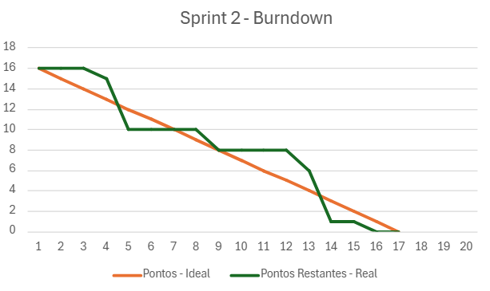

<h1 align="center"> floatData - Sprint 2 </h1>
<h2 align="center"> FATEC Professor Francisco de Moura, Jacareí - 4º Semestre DSM 2025 </h2>

<h1 align="center">Sprints</h1>

<h2>Sprint 2</h2>

**Período:** 16/04/2025 a 13/05/2025

**Objetivo:** Migrar a infraestrutura para a nuvem, desenvolver as telas principais da aplicação com dados reais e implementar funcionalidades essenciais de usuário.

### Tarefas da Sprint

| Tarefa | Prioridade | Pontos |
|--------------------------------------------------|:----------:|:------:|
| Hospedar banco de dados na nuvem | Alta | 5 |
| Criar dashboard com dados reais do banco | Alta | 3 |
| Criar tela Meus Dispositivos | Alta | 2 |
| Criar tela Mapa | Alta | 2 |
| Criar função de redefinição de senha | Média | 1 |
| Remodelação do protótipo | Média | 1 |
| Criar página com sobre (descrição) do projeto | Baixa | 2 |

### Descrição dos Objetivos
- **Hospedagem na Nuvem e Dashboard:** O banco de dados foi migrado para um ambiente em nuvem para garantir escalabilidade e acesso contínuo. O dashboard principal foi conectado a essa base de dados, passando a exibir informações reais e atualizadas dos dispositivos.
- **Desenvolvimento da Interface:** Foram criadas as telas essenciais para a experiência do usuário, incluindo "Meus Dispositivos" para o gerenciamento dos rastreadores e uma tela de "Mapa" para a visualização geoespacial.
- **Funcionalidades de Conta:** Foi implementada a funcionalidade de redefinição de senha para que os usuários possam recuperar o acesso à conta de forma autônoma.
- **Aprimoramento do Hardware:** O protótipo físico do dispositivo IoT passou por uma remodelação para otimizar seu design, componentes e funcionamento geral.

### Burndown

  
<i>Gráfico de Burndown do Sprint 2</i>

  

### Resultados Alcançados
- Banco de dados migrado e hospedado em ambiente de nuvem.
- Dashboard implementado e funcional, exibindo dados em tempo real.
- Desenvolvimento e entrega das telas "Meus Dispositivos" e "Mapa".
- Implementação completa da funcionalidade de redefinição de senha.
- Protótipo do dispositivo IoT remodelado e aprimorado.
- Criação ou atualização da página "Sobre" com a descrição do projeto.

  <a href="#topo">Voltar ao topo</a>

