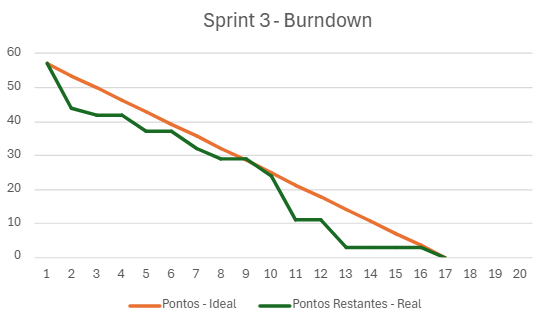

<h1 align="center"> floatData - Sprint 3 (Final) </h1>
<h2 align="center"> FATEC Professor Francisco de Moura, Jacareí - 4º Semestre DSM 2025 </h2>

<h1 align="center">Sprints</h1>

<h2>Sprint 3 (Final)</h2>

**Período:** 14/05/2025 a 11/06/2025

**Objetivo:** Finalizar as funcionalidades centrais do projeto, como cálculo de trajetória e relatórios, refinar a experiência do usuário e gerar a versão final do aplicativo para distribuição.

### Tarefas da Sprint

| Tarefa | Prioridade | Pontos |
|--------------------------------------------------|:----------:|:------:|
| Manter login | Alta | 5 |
| Nav bar embaixo | Alta | 3 |
| Pins no mapa da home com longitude e latitude reais | Alta | 5 |
| Tela de relatórios + exportar | Alta | 8 |
| Calculo de velocidade | Alta | 5 |
| Funcionalidade de trajetória | Alta | 13 |
| Rota para trazer Velocidade e Distância | Alta | 8 |
| Build .APK | Alta | 3 |
| Recuperar senha com e-mail da equipe | Média | 2 |
| Atualizar nome na homepage | Média | 2 |
| Pop-up "cadastro realizado com sucesso" | Média | 1 |
| Botão de visualizar senha | Baixa | 2 |

### Descrição dos Objetivos
- **Funcionalidades de Rastreamento Avançado:** Foram implementadas as funcionalidades mais robustas do sistema, incluindo o cálculo de velocidade do dispositivo e a exibição da trajetória percorrida no mapa. Para isso, o backend foi atualizado com rotas específicas para fornecer esses dados ao aplicativo.
- **Relatórios e Dados Reais:** Foi desenvolvida uma tela de relatórios que permite ao usuário visualizar o histórico de dados e exportá-los. Além disso, os pins no mapa da tela inicial passaram a refletir com precisão a longitude e latitude reais enviadas pelos dispositivos.
- **Melhorias de Usabilidade (UX):** Foram adicionados diversos refinamentos na interface para melhorar a experiência do usuário, como uma barra de navegação inferior, a opção de "manter login" para não precisar logar a cada acesso, um botão para visualizar a senha digitada e um pop-up de confirmação de cadastro.
- **Entrega Final:** O ciclo de desenvolvimento do produto foi concluído com a geração do arquivo de instalação do aplicativo Android (.APK), deixando-o pronto para a distribuição e instalação.

### Burndown

  
<i>Gráfico de Burndown do Sprint 3</i>

  

### Resultados Alcançados
- Cálculo de velocidade e funcionalidade de trajetória totalmente implementados.
- Tela de relatórios com função de exportação de dados finalizada.
- Pins no mapa exibindo as localizações reais e precisas dos dispositivos.
- Melhorias significativas de usabilidade, como login persistente e feedbacks visuais (pop-ups).
- Versão final do aplicativo Android (.APK) gerada com sucesso, concluindo o escopo do projeto.

  <a href="#topo">Voltar ao topo</a>

